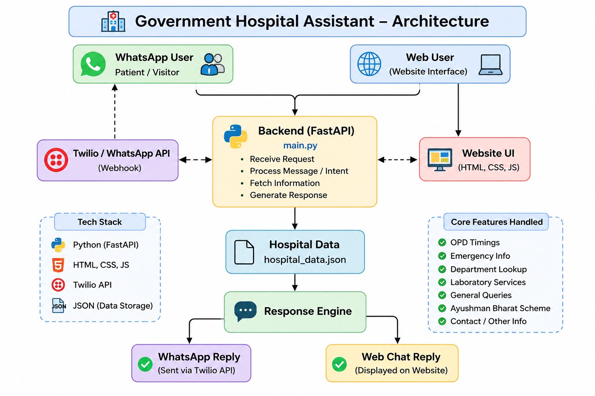

                    +----------------------+
                    |   WhatsApp User      |
                    +----------------------+
                              |
                              |
                              v
                  +------------------------+
                  |  Twilio WhatsApp API   |
                  |      (Webhook)         |
                  +------------------------+
                              |
                              |
                              v
      +-----------------------------------------------+
      |            FastAPI Backend (main.py)           |
      |-----------------------------------------------|
      | • Receive Message                             |
      | • Detect Intent                              |
      | • Read hospital_data.json                    |
      | • Generate Response                          |
      +-----------------------------------------------+
                    |                      |
                    |                      |
                    v                      v
      +----------------------+     +----------------------+
      | hospital_data.json   |     | Website UI           |
      | Hospital Information |     | HTML • CSS • JS      |
      +----------------------+     +----------------------+
                    |                      ^
                    |                      |
                    +----------+-----------+
                               |
                               v
                    +----------------------+
                    |  Response Generated  |
                    +----------------------+
                               |
                +--------------+--------------+
                |                             |
                v                             v
     +----------------------+      +----------------------+
     | WhatsApp Reply       |      | Website Chat Reply   |
     +----------------------+      +----------------------+

# Government Hospital Chatbot Architecture

## Architecture Diagram

## Overview

The chatbot supports both website users and WhatsApp users.

Flow:

1. User sends a message through the Website or WhatsApp.
2. Twilio forwards WhatsApp messages to the FastAPI backend.
3. The backend processes the user's intent.
4. Hospital information is fetched from `hospital_data.json`.
5. A response is generated.
6. The response is returned to the Website or WhatsApp.
     